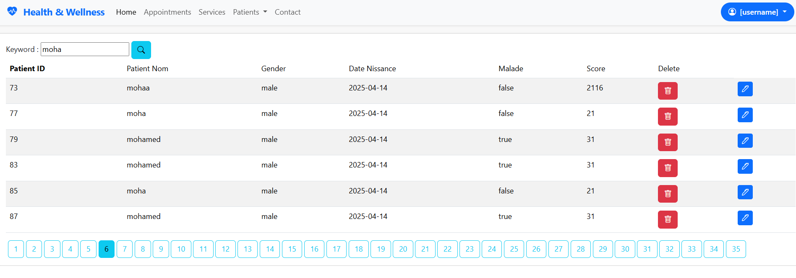
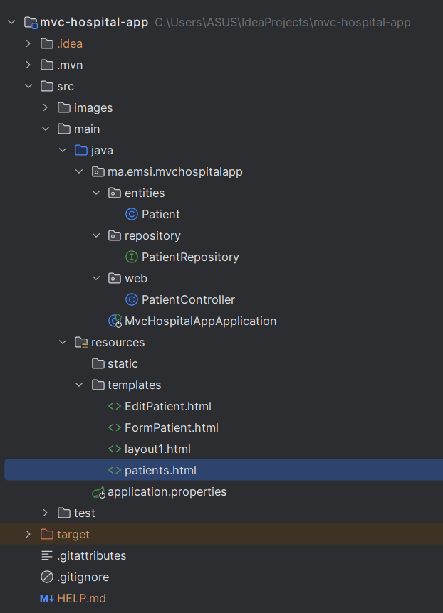

<h2> MVC-gestion des patients application j2ee</h2>

 Application MVC-Springboot pour gérer les patients avec des fonctionnalités comme la recherche par mot-clé et la suppression avec confirmationet la modifcation de patient .

This application, built with Spring Boot and the MVC architecture, provides a user-friendly interface for managing patient information. Key features include keyword-based searching and deletion with confirmation to prevent accidental data loss and updating a patient.

